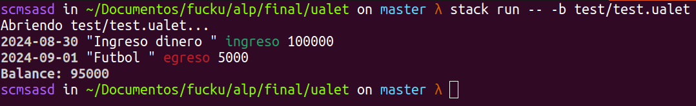

# Ualet

Sebastián Morales - M-6501/3

Prof. Cecilia Manzino

---

## Introducción

Ualet es una herramienta que lee transacciones financieras de un archivo de texto (llamado journal, bitácora) y permite realizar distintas operaciones sobre ellas, como el cálculo de balance final y los resúmenes mensuales. Su diseño e implementación fueron inspirados en hledger, un software de contabilidad diseñada para registrar dichas transacciones y aplicando un sistema de contabilidad de doble entrada.

Salida del comando `stack run -- -h`

```
Aplicación Ualet de la materia ALP.

Usage: ualet-exe [(-m|--monthonmonth) | (-b|--balance)] [FILES...]

  Ualet

Available options:
  -m,--monthonmonth        Obtener balance mes a mes de la bitácora
  -b,--balance             Obtener balance de la bitácora
  -h,--help                Show this help text
```



El informe va a seguir el orden de las etapas definidas por el intérprete en el código.

Archivo -> Lexing/parsing -> Eval -> Prettyprinting

## Archivo

Se propone un formato simple que condense toda la información útil en un renglón por transacción: Fecha, descripción, tipo de movimiento (ingreso o egreso) y el monto.

```
2024-08-30 - Ingreso dinero - ingreso:100000
2024-09-01 - Futbol - egreso:5000
```

## Lexing/parsing

La gramática que genera una transacción del journal es la siguiente: 

```
trx ::= date "-" descr tipo ":" monto
date ::= natural "-" natural "-" natural  
descr ::= string "-"  
tipo ::= "ingreso" | "egreso"  
monto ::= natural
```

Tanto el lexing como el parsing se encuentran en el archivo src/Parse.hs. El lexing es bastante básico 

```haskell
lexer :: Tok.TokenParser u
lexer =
        Tok.makeTokenParser $
                emptyDef
                        { commentLine = "#"
                        , reservedNames = ["ingreso", "egreso"]
                        , reservedOpNames = [":", "-"]
                        }

```

Y el parsing de una transacción también

```haskell
parseEntry :: P Entry
parseEntry = do
        whiteSpace
        fec <- parseDate
        reservedOp "-"
        descr <- parseDescr
        -- reservedOp "-"
        tip <- parseTipo
        reservedOp ":"
        Entry fec descr tip <$> parseMonto
```

## Eval
Ualet cuenta con dos operaciones: el cálculo de balance total y el cálculo de balance mes a mes. Ambos evaluadores se encuentran en src/Eval.hs

El balance total consiste en calcular la sumatoria de todas las transacciones de un journal, en donde el valor de las transacciones de tipo ingreso es positivo y el de las de tipo egreso, negativo. Es posible definir journals cuyo balance total sea negativo. 

```haskell
evalBalance :: (MonadUalet m) => Journal -> m Int
evalBalance (Journal entrylist) = foldM evalSumEntry 0 entrylist

evalSumEntry :: (MonadUalet m) => Int -> Entry -> m Int
evalSumEntry acc e = return (sumEntry acc e)
```

Para el balance mes a mes, se agrupan previamente las transacciones por mes.

```haskell
evalMoM :: (MonadUalet m) => Journal -> m (Map YearMonth Int)
evalMoM j = return $ monthOnMonth j

monthOnMonth :: Journal -> Map YearMonth Int
monthOnMonth = calcMoM . groupByMonth
```

## Prettyprinting
Se implementaron dos printers: uno básico, perteneciente a la mónada MonadUalet, y un prettyprinter definido en src/PPrint.hs. El primero es utilizado para mostrar el journal parseado y el segundo para los operadores definidos.

Para el prettyprinter, se hizo uso de la librería Prettyprinter. Los colores aplicados son: 
 - verde, para el token 'ingreso'
 - rojo, para el token 'egreso'
 - blanco negrita, para la fecha y balances
